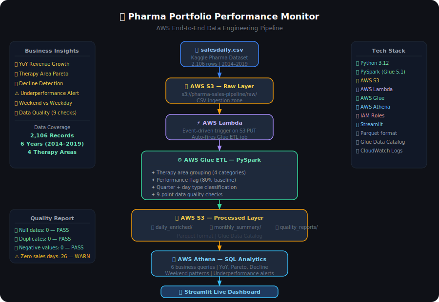

# 💊 Pharma Portfolio Performance Monitor
### End-to-End AWS Data Engineering Pipeline



[](https://aws.amazon.com)
[](https://python.org)
[](https://spark.apache.org)
[](https://streamlit.io)

---

## 📌 Business Problem

Pharma leadership relies on **month-old Excel reports** to track therapy area performance — causing delayed decisions, missed revenue opportunities, and no visibility into declining drug categories until damage is done.

> *"Which therapy areas are underperforming? Is our portfolio declining? Are there seasonal patterns we're missing?"* — These questions took weeks to answer manually.

---

## ✅ Solution

An **event-driven, serverless AWS data pipeline** that:
- Auto-ingests daily pharma sales data on every S3 upload
- Applies PySpark ETL transformations with 9-point quality checks
- Makes data queryable via Athena SQL in minutes
- Delivers **6 real business insights** via a live Streamlit dashboard

**Result: Reporting lag reduced from 30 days → real-time.**

---

## 🏗️ Architecture

```
📄 salesdaily.csv (Kaggle)
         ↓
🪣 AWS S3 — Raw Layer
   s3://pharma-sales-pipeline/raw/
         ↓
⚡ AWS Lambda
   Event-driven trigger on every S3 PUT
         ↓
⚙️  AWS Glue ETL — PySpark (Glue 5.1)
   ├── Therapy area grouping (4 categories)
   ├── Performance flagging (80% baseline)
   ├── Quarter + day type classification
   ├── Dominant therapy detection
   └── 9-point data quality checks
         ↓
🪣 AWS S3 — Processed Layer (Parquet)
   ├── daily_enriched/
   ├── monthly_summary/
   └── quality_reports/
         ↓
🔍 AWS Athena — SQL Analytics
   6 business queries across therapy areas
         ↓
📊 Streamlit Live Dashboard
   Public URL | Executive-ready insights
```

---

## 🛠️ Tech Stack

| Layer | Technology | Purpose |
|---|---|---|
| Storage | AWS S3 | Data lake — raw + processed layers |
| Trigger | AWS Lambda | Event-driven pipeline automation |
| ETL | AWS Glue + PySpark | Data transformation + quality checks |
| Catalog | Glue Data Catalog | Schema management |
| Analytics | AWS Athena | Serverless SQL on S3 |
| Security | AWS IAM | Role-based access control |
| Dashboard | Streamlit | Live executive dashboard |
| Format | Parquet | Optimised columnar storage |
| Logging | CloudWatch | Lambda + Glue job monitoring |

---

## 📊 Key Business Findings

### Finding 1 — Analgesics Dominate Portfolio (Concentration Risk)
> Analgesics account for **₹71,177 of ₹127,595 total revenue — 55.8% of the entire portfolio.**
> Anti-Inflammatory (14.7%), CNS Drugs (15.6%), and Respiratory (13.9%) make up the rest.
> 
> ⚠️ **Business Risk:** Over-reliance on a single therapy area creates portfolio concentration risk. A decline in Analgesics alone would impact more than half of total revenue — a strategic vulnerability ZS helps pharma clients actively manage.

---

### Finding 2 — 2017 and 2019 Were Crisis Years
> Portfolio saw **-23.1% YoY decline in 2017** and **-25.3% in 2019** — the two worst performing years.
> 2018 showed strong recovery at **+18.0% YoY growth**, suggesting successful intervention.
>
> 📈 Growth trajectory: 2014 → 2015 (+12.4%) → 2016 (+10.9%) → 2017 (-23.1%) → 2018 (+18.0%) → 2019 (-25.3%)
>
> ⚠️ **Business Implication:** The volatility pattern suggests external market shocks or product lifecycle events — exactly the kind of trend pharma leadership needs to detect early to enable corrective action.

---

### Finding 3 — Q4 is Consistently the Best Quarter (Every Single Year)
> Q4 ranked **#1 in revenue for 5 out of 6 years** (2014–2018).
> Q1 consistently ranked #2.
> Q2 and Q3 are persistently the weakest quarters across all years.
>
> **Exception:** 2019 Q4 collapsed to ₹538 — lowest quarterly revenue in the entire dataset, signalling a sharp end-of-year decline.
>
> 💡 **Business Implication:** Inventory planning and sales rep targets should be front-loaded to Q4. Q2/Q3 should trigger mid-year performance reviews.

---

### Finding 4 — 2017 Q2 Was the Most Underperforming Period
> **70.3% of days in 2017 Q2 were underperforming** — highest underperformance rate in the dataset.
> 2017 Q3 followed closely at 66.3%.
>
> Top 3 worst quarters by underperformance rate:
> 1. 2017 Q2 — 70.3% bad days
> 2. 2017 Q3 — 66.3% bad days
> 3. 2014 Q3 — 54.3% bad days
>
> 💡 **Business Implication:** Q2 and Q3 of 2017 required strategic intervention. This automated alert — flagging quarters where >50% of days underperform — would have enabled leadership to act weeks earlier.

---

### Finding 5 — October 2019 Saw a -70.5% Single Month Collapse
> The worst single-month decline in the dataset: **October 2019 dropped -70.5% vs September 2019** (₹538 vs ₹1,824).
> February 2017 saw the second worst at -46.4%.
>
> 💡 **Business Implication:** These sharp single-month drops are invisible in quarterly reports. The pipeline's month-over-month decline detection surfaces them automatically — enabling immediate investigation.

---

### Finding 6 — Weekends Outperform Weekdays
> **Weekend average: 63.40 units/day vs Weekday average: 59.46 units/day** — a 6.6% demand premium on weekends.
>
> 💡 **Business Implication:** Distribution scheduling and pharmacy restocking should prioritise weekend demand. Sales rep visit patterns should be adjusted accordingly.

---

### Finding 7 — Data Quality: Clean Pipeline
> 9 automated quality checks run on every pipeline execution:

| Check | Result | Status |
|---|---|---|
| Total Records | 2,106 | ℹ️ INFO |
| Null Dates | 0 | ✅ PASS |
| Duplicate Dates | 0 | ✅ PASS |
| Negative Sales | 0 | ✅ PASS |
| Zero Sales Days | 26 | ⚠️ WARN |
| Avg Daily Sales | 60.59 | ℹ️ INFO |
| Underperforming Days | 619 | ℹ️ INFO |
| Date Range Start | 01/01/2015 | ℹ️ INFO |
| Date Range End | 09/09/2019 | ℹ️ INFO |

> Pipeline halts automatically if any FAIL condition is detected — preventing bad data from reaching the dashboard.

---

## 📁 Repository Structure

```
pharma-sales-pipeline/
├── app.py                    ← Streamlit dashboard
├── glue_etl_job.py           ← PySpark ETL script
├── lambda_function.py        ← Lambda trigger code
├── architecture_diagram.svg  ← Pipeline architecture
├── requirements.txt          ← Python dependencies
├── data/
│   ├── YOY_growth.csv
│   ├── Revenue.csv
│   ├── Declining_months.csv
│   ├── Weekend_pattern.csv
│   ├── Quarterly_rank.csv
│   ├── Underperformance.csv
│   └── Quality_report.csv
└── README.md
```

---

## 🚀 How to Run Locally

```bash
# Clone the repository
git clone https://github.com/lakshyarajpurohit/Pharma-ETL-AWS.git

# Navigate into the project directory
cd Pharma-ETL-AWS

# Create virtual environment using pipenv
# Install Pipenv (if you haven't already)
pip install pipenv

# Install the required dependencies from the Pipfile
pipenv install

# Activate the project's virtual environment
pipenv shell

# Install dependencies
pip install -r requirements.txt

# Run dashboard
streamlit run app.py
```

---

## ☁️ AWS Setup (Replicate the Pipeline)

1. Create S3 bucket with `/raw/` and `/processed/` folders
2. Create IAM role with `AmazonS3FullAccess` + `AWSGlueServiceRole`
3. Create Glue ETL job using `glue_etl_job.py` — assign IAM role
4. Create Glue Crawler pointing to `/processed/` → database: `pharma-db`
5. Create Lambda function using `lambda_function.py` — add S3 trigger on `/raw/`
6. Upload `salesdaily.csv` to S3 `/raw/` → pipeline auto-runs
7. Query results in Athena under `pharma-db`

---

## 📈 Live Dashboard

🔗 **[View Live Dashboard](https://pharma-etl-aws-akixxrj6qhca8ggzwqjygw.streamlit.app/)**

---

## 👤 Author

**Lakshya Rajpurohit**
Data Engineering | AWS | Python | PySpark
📧 [lakshyar819@gmail.com] | 🔗 [https://www.linkedin.com/in/lakshya-rajpurohit-1a5869225/] | 💻 [https://github.com/lakshyarajpurohit]